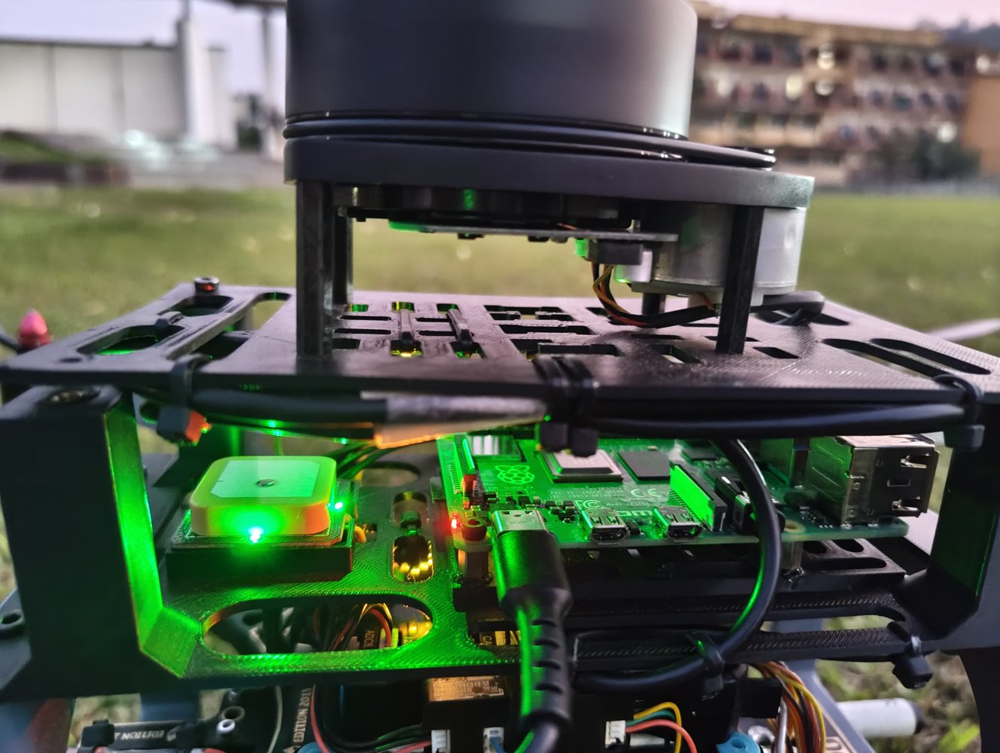
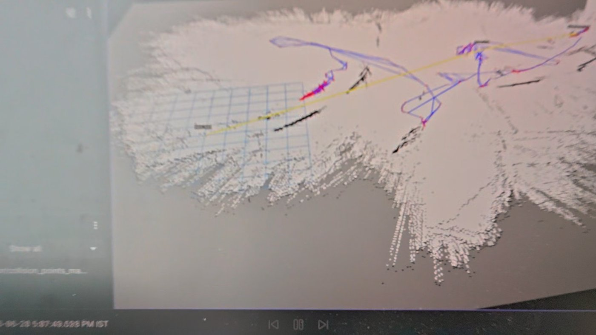
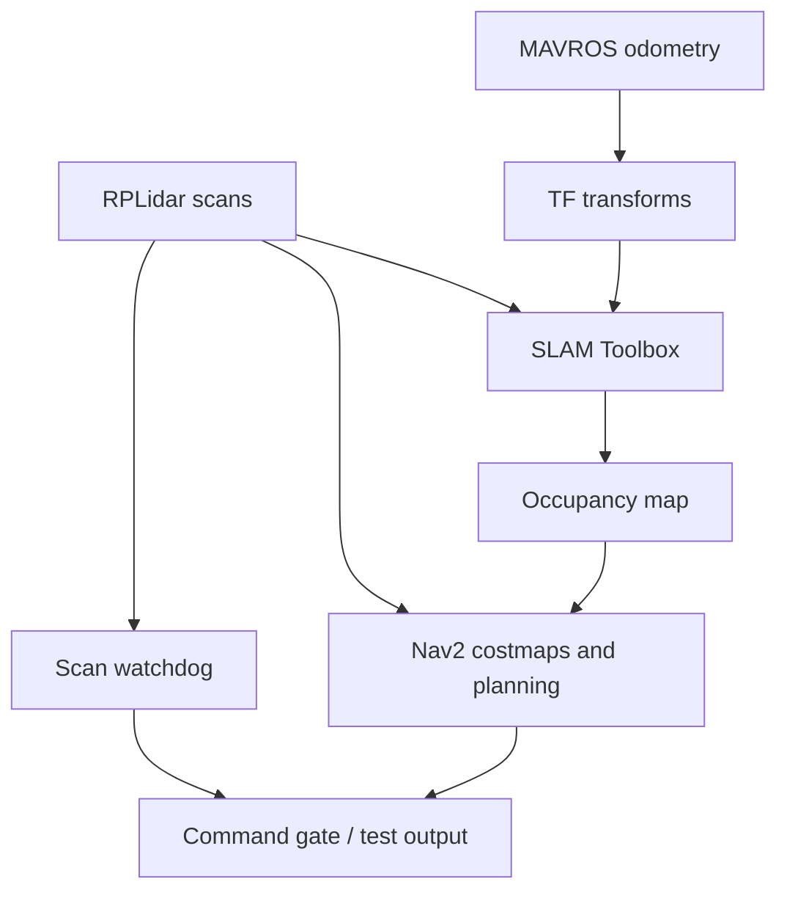

# LiDAR Drone Navigation

**GPS-assisted 2D mapping and path-planning research with ROS 2 Jazzy.**

A Raspberry Pi processes RPLidar scans and flight-controller odometry to build an occupancy map and support Nav2 path planning. ArduPilot handles vehicle estimation and flight control.

| Onboard hardware | Mapping visualization |
| --- | --- |
|  |  |

**[Watch the field-flight video · 38 seconds](assets/videos/VID-20261001-WA0038.mp4)** · [Mapping session video](assets/videos/VID-20261001-WA0031.mp4) · [Full media catalogue](docs/evidence.md)

The field flight is understood to have been manual, based on the project maintainer's recollection. The videos document the prototype and field work; autonomous path execution has not been established.

## Hardware

| Component | Role |
| --- | --- |
| Raspberry Pi 4 Model B | ROS 2 companion computer |
| Pixhawk 2.4.8 with ArduPilot | State estimation and flight control |
| RPLidar A1 over USB | 2D laser scanning |
| Pi-to-Pixhawk UART | MAVLink telemetry through MAVROS |

See [hardware details and assumptions](docs/architecture.md) for the configuration still to be confirmed.

## Mapping pipeline



The support package provides `odom_to_tf`, `goal_relay`, `laser_safety_stop` and `cmd_vel_mux`, plus tools for configuration, recording and odometry analysis. Its velocity output ends at `/lidar_drone/cmd_vel_checked`; an autopilot command adapter is not included.

## Current status

The hardware and field media are documented. The Python support nodes are **reconstructed implementations**, with 14 offline unit tests; ROS integration and flight validation remain pending. Original scripts, tuned YAML, ROS bags and map exports will be added when recovered. See [validation](VALIDATION.md) and [pending work](docs/missing-inputs.md).

## Get started

Run the offline checks from the repository root with Python 3.10+:

```bash
python3 -m unittest discover -s tests -v
```

For ROS 2 Jazzy, follow [setup and operation](docs/setup.md). The [interface guide](docs/interfaces.md) defines topics, transform ownership and watchdog behavior.

| Explore | Contents |
| --- | --- |
| [Code](lidar_drone/) · [Configuration](config/) · [Tools](tools/) | Support nodes, bench defaults and data utilities |
| [Data guide](docs/data.md) · [Troubleshooting](docs/validation.md) | Recording, analysis and integration checks |
| [Media catalogue](docs/evidence.md) | Photos, videos and evidence status |
| [Draft manuscript and notes](source_material/README.md) | Unfinished research draft and original launch notes |

## Team and manuscript

Maintained by [Pratham](https://github.com/Pratham-G-R). See [authors and credits](AUTHORS.md) for the project team.

The manuscript is an **unfinished draft**: references and template remnants still need correction. It is not a published paper. Project licensing is [pending](LICENSE-NOTICE.md).
