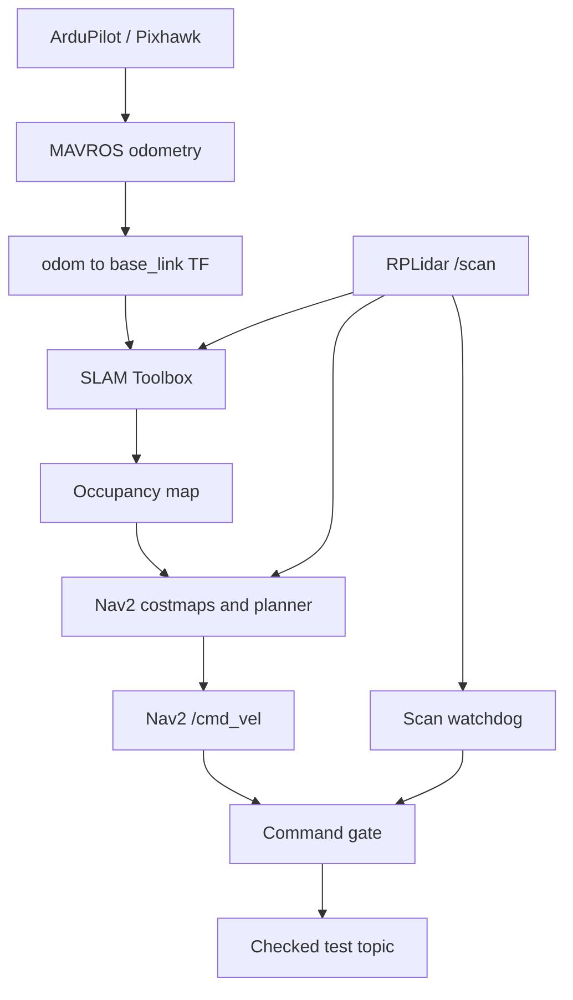

# LiDAR Drone Navigation

**ROS 2 Jazzy · Raspberry Pi 4 · Pixhawk · RPLidar A1 · SLAM Toolbox · Nav2**

A research project exploring GPS-assisted 2D occupancy mapping and planar path planning on a drone. The companion computer builds the map and computes paths while ArduPilot handles vehicle estimation and flight control.


## Project status

This repository organizes the supplied project manuscript, terminal notes, 13 photographs and three videos. It also provides newly reconstructed support code and tools for collecting reproducible results. **The original Python scripts and tuned YAML files were not supplied. The new code has offline tests but has not been run on ROS hardware or flight-tested.**

| Component | Available evidence / implementation |
| --- | --- |
| Hardware integration | Photographs of LiDAR, companion computer and airframe; hardware specifications reported in manuscript |
| Occupancy mapping and visualization | Manuscript descriptions and photographed displays |
| Costmaps and global path planning | Reported in manuscript; map/path-like overlays visible, topic identities not independently established |
| Flight activity | User recalls manual flight (2026-10-02); media is not evidence of autonomous execution |
| Support nodes | New implementation in `lidar_drone/`, explicitly reconstructed |
| Original experiment settings | Missing; generator creates reviewable templates from installed ROS defaults |
| Quantitative results | No ROS bags, raw maps, FCU logs or measured evaluation tables supplied |
| GPS-denied RF2O and map sharing | Proposed extensions; not implemented or validated here |

## What is included

- Four ROS 2 executables: `odom_to_tf`, `goal_relay`, `laser_safety_stop`, `cmd_vel_mux`.
- Receipt-time watchdogs and finite-value checks, with unit tests independent of ROS.
- Config generator, support launch file, bag recording and CSV analysis tools.
- Architecture, setup, troubleshooting, evidence, data and validation documentation.
- All 18 original attachments, a SHA-256 source manifest, and lightweight README previews.

The checked velocity output is `/lidar_drone/cmd_vel_checked`. **There is no autopilot command bridge in this reconstruction.** Publishing a Nav2 body-frame velocity directly to a world-frame MAVROS interface would be incorrect; integration requires the actual FCU configuration and validation described in [the interface guide](docs/interfaces.md).

## Architecture



The repository ends at the checked test topic. The manuscript describes a further MAVROS-to-autopilot control stage, whose implementation is missing.

## Start here

For a review on any Python 3.10+ machine:

```bash
python3 -m unittest discover -s tests -v
python3 -m compileall -q lidar_drone launch tools
```

For the ROS machine, follow [setup and operation](docs/setup.md), starting with odometry and LiDAR inspection. Do not run the archived terminal notes verbatim: they contain an absolute home path, permissive serial permissions and two possible publishers of the same TF edge.

| Directory | Contents |
| --- | --- |
| `lidar_drone/` | Reconstructed Python package and ROS-independent gate logic |
| `launch/`, `config/` | Support-node launch and bench defaults |
| `tools/` | Config preparation, bag recording, odometry analysis |
| `docs/` | Setup, architecture, interfaces, evidence, validation and missing inputs |
| `assets/photos/`, `assets/videos/` | Original user-supplied media |
| `assets/previews/` | Smaller, re-encoded images for documentation |
| `source_material/` | Unmodified notes/manuscript and extracted manuscript text |
| `data/` | Provenance manifest and schemas; no fabricated field measurements |
| `tests/`, `.github/workflows/` | Offline regression checks and GitHub CI definition |

## Visual record


The photograph records a visualization, not a calibrated map export. See [the evidence catalogue](docs/evidence.md) for all media and interpretation limits.

## Documentation

- [Setup and operation](docs/setup.md)
- [Architecture and assumptions](docs/architecture.md)
- [Topics, frames and node behavior](docs/interfaces.md)
- [Data collection and analysis](docs/data.md)
- [Evidence and claim status](docs/evidence.md)
- [Validation and troubleshooting](docs/validation.md)
- [Missing inputs from the project team](docs/missing-inputs.md)
- [Primary technical references](docs/references.md)
- [Publication steps](docs/github.md)

## Credits and reuse

The supplied draft lists Rochak Srivastav, Pratham, Tanish Deshmukh, Vemula Eshwar Ranga, Arijit Dey and Prof. Santosha K. Dwivedy. Author order, affiliations and contributions require confirmation. See [AUTHORS.md](AUTHORS.md).

No open-source license has been selected for project code or media. See [LICENSE-NOTICE.md](LICENSE-NOTICE.md). Upstream ROS projects keep their own licenses. The manuscript contains unfinished template references and should not be treated as a published or citation-ready paper.
